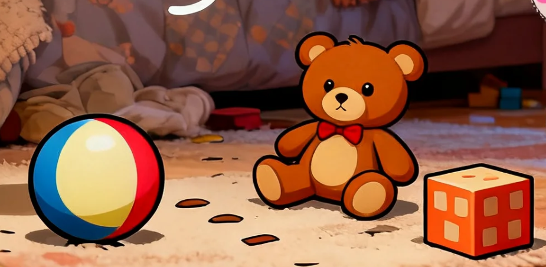

"Little Panda Qiqi's Bedtime Routine" — An Interactive Storybook App for Children's Habit Formation

Design Documentation

By Wang Nan

# Concept Paper

## Introduction

This project aims to design and prototype an interactive storybook application titled "Little Panda Qiqi's Bedtime Routine." The app primarily targets toddlers aged 2 to 4 and their parents. It addresses the common challenges of resistance and procrastination during bedtime preparations by transforming mundane routines into an engaging adventure through an immersive story experience.

The inspiration for this project stems from a universal parenting reality: establishing a consistent bedtime routine is crucial for a child's development, yet the process is often fraught with challenges and parental stress. While numerous storybook apps exist in the market, there remains significant potential for products that deeply integrate specific life skill cultivation with a coherent narrative.

The core design philosophy of this application is "Guiding Habits through Interaction." The user (the child) will act as a companion to the little panda, Qiqi. Across four core scenes, through simple touch interactions like tapping and dragging, the user will help Qiqi complete tasks such as "Putting Toys Away," "Bubble Brushing," "Cozy Bath Time," and "Goodnight Story." Each successful interaction advances the storyline and provides the user with positive visual and auditory feedback, thereby subtly guiding children to imitate and learn correct bedtime behaviors through a sense of achievement.

This project will adhere to user-centered design principles. Starting from defining the target users and their needs, it will utilize storyboards, wireframes, and a paper prototype to fully present the user journey and interface of this application, laying a solid foundation for developing a children's product that is truly educational, entertaining, and alleviates parental anxiety.

## Description

Tonight, you get to help Little Panda Qiqi get ready for bed! When you open "Little Panda Qiqi's Bedtime Routine," you are first greeted by soft music and a view of Qiqi under a starry night sky, rubbing his eyes and feeling sleepy. On the home screen, you see a sparkling "Start the Adventure!" button. Tapping on it begins our story!

First Stop: The Toy Garden. You see that Qiqi's room is messy, with toys scattered all over the floor. A toy chest is bouncing nearby. You need to gently drag each toy into the chest. When you place the last toy inside, the lid will snap shut with a satisfying sound. Qiqi will clap his hands joyfully, and all the toys inside will glow softly, as if whispering goodnight to you.

Second Stop: The Brushing Pro. Next, you and Qiqi head to the bathroom. In the mirror, Qiqi is holding his toothbrush, waiting for you. There's a tube of toothpaste on the counter. Tapping on the tube will squeeze a perfect amount of paste onto Qiqi's brush. Then, you need to swipe your finger gently back and forth across the screen to help Qiqi brush his teeth. As you swipe, the brush will move, creating lots of foamy bubbles, and Qiqi's teeth will become sparkling clean!

Third Stop: The Warm Bubble Bath. After brushing, it's time for a cozy bath. The tub is filled with water, but it needs bubbles! A bottle of bubble bath is sitting nearby. Tapping the bottle will release a joyful "poof" of colorful bubbles that fill the entire tub! You can also tap on the little rubber duck floating in the water, and it will respond with a cheerful "quack," making bath time even more fun for Qiqi.

Fourth Stop: The Goodnight Story. All clean and in his pajamas, Qiqi snuggles into bed, ready for a bedtime story. Three different storybooks are on the shelf. Tapping on one of them will make it fly down and open its pages automatically. You can swipe from left to right to turn the pages and enjoy the beautiful illustrations inside. When the story ends, Qiqi will let out a big, happy yawn and close his eyes contentedly.

Finally, you will arrive at the credits page, where the Moon Granny and twinkling stars will say to you, "You were wonderful! You helped Qiqi complete all his tasks. Now it's your turn to sleep tight, just like Qiqi. Goodnight!"

## Key Features

Contextual Task-Based Interactions: Real-life bedtime routine steps (e.g., tidying toys, brushing teeth) are seamlessly integrated into the story narrative. Children directly participate in and drive the story forward through intuitive gestures like dragging and swiping, transforming "parental instructions" into the "need to help a friend," thereby fostering intrinsic motivation.

Positive Behavior Guidance & Instant Feedback System: Every correct interaction triggers positive visual and auditory feedback (e.g., cheerful animations, encouraging sound effects, and character praise). This instant sense of achievement reinforces the child's correct behavior, subtly guiding and transferring these habits to real-life situations.

Explorable Soothing Mini-Games: Beyond the core routine, the app incorporates moments of relaxed exploration (e.g., tapping a rubber duck in the bath to hear a quack). These low-pressure, high-delight interactive elements not only enhance replay value but also help soothe a child's pre-sleep mood, creating a calm and pleasant bedtime atmosphere.

## Theme / Concept Art

The overall visual theme of this project is defined as "Cozy, Dreamy, and Cute," aiming to create a safe, comfortable, and imaginative pre-sleep world for young children. The visual design will adopt a soft, hand-drawn style, avoiding sharp lines and high-contrast colors to protect children's eyesight and soothe their mood.

### Visual Style References:

Color Palette: The primary color scheme will utilize nighttime shades of deep blue, purple, and warm yellow to create a tranquil bedtime atmosphere. Characters and interactive elements will employ bright yet non-stimulating candy colors (e.g., Qiqi's reddish-brown, the light pink of bubbles, the light blue of water) to ensure visibility against darker backgrounds and evoke a sense of delight.

Character Design Concept: The design of the protagonist, Little Panda Qiqi, will emphasize "roundness, softness, and friendliness." He will feature a large head, big round eyes, and soft body curves. His expressions will be rich and slightly exaggerated to convey clear emotions (e.g., sleepiness, happiness, surprise), making it easy for young children to understand and empathize.

Scene & UI Concept: Scene designs will incorporate dreamlike elements, such as starry backgrounds, glowing toys, and soft cloud-like edges. User Interface (UI) elements, like buttons and icons, will be designed with rounded corners and integrated into natural objects (e.g., cloud-shaped buttons, star icons), making them part of the scene rather than stark overlays.

## Concept Map

## Evaluation

To validate the concept and gather valuable feedback during the early design phase, the following short questionnaire has been devised. It aims to understand the initial perceptions of the target audience (or their proxies, such as parents or tutors) regarding the design of "Little Panda Qiqi's Bedtime Routine" interactive storybook, based on core user experience principles.

### Concept Feedback Questionnaire

Please answer the following questions based on the concept description, key features, and story flow provided in the report above.

(Appeal & Motivation) How appealing do you find the core concept of "helping the little panda complete his bedtime tasks" for toddlers aged 2-4? Do you think it would effectively motivate a child to imitate these bedtime habits?

□ Very Appealing

□ Somewhat Appealing

□ Neutral

□ Not Very Appealing

(Clarity & Learnability) Without relying on text instructions, how well do you think a young child could independently understand what is required in each scene through iconography and animation cues (e.g., a bouncing toy chest, a glowing toothpaste tube)?

□ Perfectly Clear

□ Mostly Clear

□ Somewhat Unclear

□ Very Unclear

(Flow & Navigation) Does the linear flow from "Tidying Toys" to "Listening to a Story" align with your understanding of a child's bedtime routine? Do you find this flow logical and smooth?

□ Very Logical & Smooth

□ Mostly Logical

□ The sequence could be adjusted (Please specify: \***\*\_\*\***)

□ Illogical

(Emotion & Feedback) How important do you believe the instant feedback system (e.g., Qiqi's praise, visual and sound rewards upon task completion) is for enhancing a toddler's sense of achievement and enjoyment?

□ Crucial

□ Important

□ Moderately Important

□ Not Important

(Overall Potential & Concerns) Overall, what is your assessment of this app concept's potential in helping toddlers establish good bedtime habits? What is your biggest concern or the one area you feel needs the most improvement?

# Functional Specification

## Storyboards

Title: Home Page Frame ID: Home

Dimensions:

16:9 (e.g., 1920x1080px)

Media Used:

Digital Illustration, Gentle Background Music

Buttons:

A large, glowing "Start " button in the center, using the Primary Button style (Warm Yellow Cloud).

Background:

A serene night sky gradient (deep blue to purple) with subtle twinkling stars. Little Panda Qiqi is sitting sleepily in a cozy corner of his room.

Content:

The app title "Little Panda Qiqi's Bedtime Routine" is displayed in a friendly, hand-drawn font at the top.

Description (purpose / objectives):

To welcome the user, set the calm and cozy mood of the app, and clearly present the

single primary action: starting the story.

Animations:

The "Start the Adventure!" button gently pulses (breathes) to attract attention.

User Interactions Required:

Tap on the "Start" button.

User Feedback:

Upon tap, the button visually depresses (scale down) and plays a soft, positive "click"

sound.

Navigation / Links:

Proceeds to Frame ID: Scene1_TidyUp

Title: Tidy Up Toys Frame ID: Scene1_TidyUp

Dimensions:

16:9 (e.g., 1920x1080px)

Media Used:

Digital Illustration, Sound Effects (drag, drop, success chime)

Buttons:

The bouncing Toy Chest (acts as an Icon Button).

Three scattered toys (a ball, a teddy bear, a block) are also Interactive Objects.

Background:

Qiqi's cozy bedroom. The room is messy. Qiqi is standing looking at the mess, with a slightly helpless but hopeful expression.

Content:

The page indicator at the bottom shows the first dot as active (yellow).

Description (purpose / objectives):

To engage the user in the first bedtime task (tidying up) through direct manipulation

(drag & drop), teaching responsibility and initiating the routine.

Animations:

The toy chest bounces slightly.

When a toy is dragged, it follows the finger.

User Interactions Required:

Drag a toy and drop it into the toy chest.

User Feedback:

When a toy is successfully dropped in the chest, it disappears with a soft "poof" sound and a little sparkle effect.

After the last toy is put away, the chest lid closes, Qiqi claps his hands joyfully, and a cheerful success chime plays.

Navigation / Links:

After all toys are tidied, an automatic transition (or a "Next" button appearing) leads to Frame ID: Scene2_BrushTeeth.

Title: Brush Teeth Frame ID: Scene2_BrushTeeth

Dimensions:

16:9 (e.g., 1920x1080px)

Media Used:

Digital Illustration, Sound Effects (squeeze, brushing, rinse)

Buttons:

Toothbrush (Interactive Object).

Background:

A clean, warm-toned bathroom. Qiqi is standing in front of the sink, looking into the mirror. The mirror reflects Qiqi and the user's "point of view".

Content:

The page indicator at the bottom shows the second dot as active.

Description (purpose / objectives):

To guide the user through the steps of brushing teeth (brushing

action) in a fun and engaging way, normalizing this essential habit.

Animations:

A swiping motion creates foamy bubbles on the teeth.

User Interactions Required:

Swipe back and forth horizontally on the brush/teeth to simulate brushing.

User Feedback:

Each swipe creates more animated bubbles. After 5-6 swipes, Qiqi's teeth sparkle brightly, and he gives a big, shiny-toothed smile. A positive "ting!" sound plays.

Navigation / Links:

Proceeds to Frame ID: Scene3_Bath.

Title: Bubble Bath Frame ID: Scene3_Bath

Dimensions:

16:9 (e.g., 1920x1080px)

Media Used:

Digital Illustration, Sound Effects (pour, bubble)

Buttons:

Bubble Bath Bottle (Icon Button).

Background:

The bathroom scene, focusing on a bathtub filled with clear water. Qiqi is already in the tub, looking happy and expectant.

Content:

The page indicator at the bottom shows the third dot as active.

Description (purpose / objectives):

To create a relaxing and sensory play experience associated with bath time, making it a

positive part of the routine.

Animations:

Bubbles pour out and fill the tub when the bottle is tapped.The rubber duck bobs in the

water.

User Interactions Required:

Tap the bubble bath bottle.

User Feedback:

Tapping the bottle triggers a "glug" sound and a vibrant cascade of colorful bubbles instantly fills the tub, hiding Qiqi for a moment before he pops up with a happy giggle.

Navigation / Links:

Proceeds to Frame ID: Scene4_Story

Title: Goodnight Story Frame ID: Scene4_Story

Dimensions:

16:9 (e.g., 1920x1080px)

Media Used:

Digital Illustration

Buttons:

None

Background:

Qiqi's dimly lit bedroom. Qiqi is tucked into bed, under a cozy blanket, yawning.

Content:

The page indicator at the bottom shows the fourth dot as active.

Description (purpose / objectives):

To provide a calm, wind-down activity that signals the end of the routine and prepares

the child for sleep, giving them a choice in the story.

Animations:

Pages turn smoothly with a swipe.

Qiqi's eyes slowly close as the story "ends".

User Interactions Required:

Swipe left-to-right to turn the pages of the book.

User Feedback:

The selected book floats to the center of the screen and opens.

Each swipe triggers a "whoosh" page turn animation, revealing new illustrations.

On the final page, the story text ends, Qiqi's eyes close, and a gentle snoring sound is heard. The book slowly closes by itself.

Navigation / Links:

Proceeds to Frame ID: Credits.

Title: Credits Page Frame ID: Credits

Dimensions:

16:9 (e.g., 1920x1080px)

Media Used:

Digital Illustration

Buttons:

A "Read Again?" button (Primary Button style) in the corner.

Background:

.The same serene night sky as the homepage, perhaps with a sleeping moon and stars.

Content:

"You were wonderful! Goodnight!" message in a soft font.

Little Panda Qiqi is fast asleep in the center, maybe with a Zzz bubble.

Description (purpose / objectives):

To provide a satisfying conclusion, reinforce the positive behavior, and gently encourage

the child to actually go to sleep. The option to restart supports repeated use.

Animations:

The stars twinkle slowly. The "Zzz" bubble above Qiqi pulses gently.

User Interactions Required:

None required to exit. Optional tap on "Read Again?".

User Feedback:

A soft, comforting lullaby plays throughout.

Navigation / Links:

returns to Frame ID: Home
